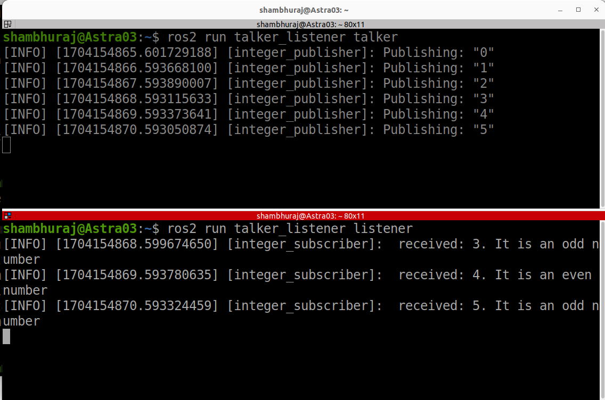

# 1.ROS_talker_listener
## Description and purpose
Here we have created a publisher and subscriber as follows.
• The publisher will publish increasing integer numbers, e.g. 1, 2, 3, 4, 5, 6, …, in every
one second.
• The subscriber will receive these numbers and for each number it will print on the
screen “I received [the_number_it_received]. It is an [even/odd] number.”

## How to build and run tests
1) Open a new terminal and source your ROS 2 installation so that ros2 commands
will work.
2) ros2 run talker_listener talker
3) ros2 run talker_listener listener
## Required dependencies to be added in package.xml
1) <exec_depend>rclpy</exec_depend>
2) <exec_depend>std_msgs</exec_depend>
Required entry points to be added in setup.py
1) entry_points={
'console_scripts': [
'talker = talker_listener.A1_Integer_pub:main',
'listener = talker_listener.A1_Integer_sub:main',
],
},
## Working of nodes
1) I have created two nodes, one is integer_publisher (ie talker) and another is
integer_subscriber (ie listener)
2) integer_publisher node has the publisher named “publisher” with following
arguments:
a) Message type : String (imported from std_msgs directory)
b) Topic name : integer_topic
c) Queue size: 10
3) publisher publishes the messages of type String on the topic integer_topic with
the queue size used for asynchronous publishing as 10.
4) timer sets the callback to execute after every 1 seconds.
5) integer_subscriber node has the subscriber named “subscription” with following
arguments:
a) Message type : String (imported from std_msgs directory)
b) Topic name : integer_topic
c) Callback function : listener_callback
d) Queue size: 10

6) subscription subscribes the topic integer_topic and fetches the message data of
type String. Data from the integer_topic is accessed in the callback function
listener_callback.
7) The frequency of incoming data is controlled by the timer of the published topic.
8) Received data is then accessed and checked if it is divisible by 2. If yes the state
of the integer value even or odd is logged.
