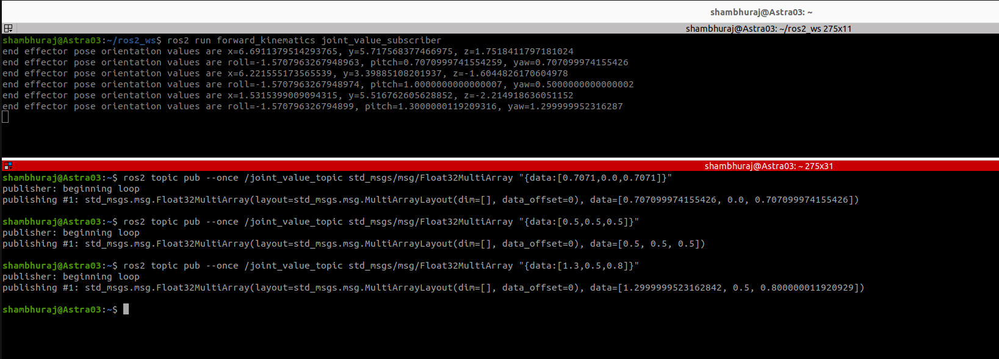

# 3.ROS_forward_kinematics

## Purpose
A node that solves the forward kinematics of the manipulator.

## Description:
Here I have created a subscriber as follows.
The subscriber will receive the message published on "/joint_value_topic" in radians in
terms of array of float values. Which then will be used to calculate the end effector pose
of the robot.
## How to build and run tests
Open a new terminal and source your ROS 2 installation so that ros2 commands will
work.
ros2 run forward_kinematics joint_value_subscriber
ros2 topic pub --once /quat_topic std_msgs/msg/Float32MultiArray
"{data:[0.7071,0.0,0.7071]}"
## Required dependencies to be added in package.xml
<exec_depend>rclpy</exec_depend>
<exec_depend>std_msgs</exec_depend>
## Required entry points to be added in setup.py
entry_points={
'console_scripts': [
'joint_value_subscriber = forward_kinematics.joint_value_subscriber:main'
],
},
## Working of nodes
1. I have created one nodes, which is "joint_value_subscriber"
2. "subscription" subscribes to the topic "joint_value_topic" and fetches the
message data of type Float32MultiArray. Data from the joint_value_topic is
accessed in the callback function "joint_value_callback".
3. Received radians values of joint rotations are then accessed and used to
calculate the end effector pose of the robot.
4. Message type : Float32MultiArray (imported from std_msgs directory)
5. Topic name : joint_value_topic
6. Callback function : joint_value_callback
7. Queue size: 10
