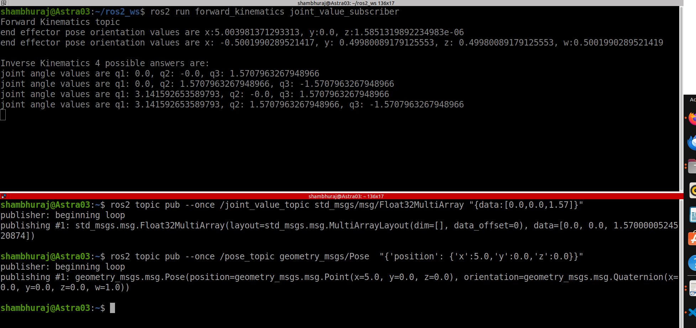

# 4.ROS_inverse_kinematics

## Purpose
Calculate the inverse kinematics of the robot.

## Description:
Here I have added the subscriber as follows.
The subscriber will receive the message published on "/pose_topic" in radians in the
form of geometry_msgs/Pose. Which then will be used to calculate the joint values of the
robot.

## How to build and run tests
Open a new terminal and source your ROS 2 installation so that ros2 commands will
work. 
ros2 run inverse_kinematics joint_value_subscriber   
ros2 topic pub --once /joint_value_topic std_msgs/msg/Float32MultiArray "{data:[0.7071,0.0,0.7071]}"  
ros2 topic pub --once /pose_topic geometry_msgs/Pose "{'position': {'x':10.0, 'y':0.0, 'z':5.0}}"  

## Working of nodes
1. I have created one nodes, which is "joint_value_subscriber"2. "subscription2" subscribes to the topic "pose_topic" and fetches the message
data of type Pose. Data from the pose_topic is accessed in the callback function
"pose_callback".
3. Received end effector pose is then accessed and used to calculate the joint
values of the robot.
4. Message type : Pose (imported from geometry_msgs directory)
5. Topic name : pose_topic
6. Callback function : pose_callback
7. Queue size: 10

## pose_callback function:
Here x,y,z values of the end effector pose are used to calculate joint values of the robot (Inverse
kinematics) using Geometric approach. Joint values found are in radians.
