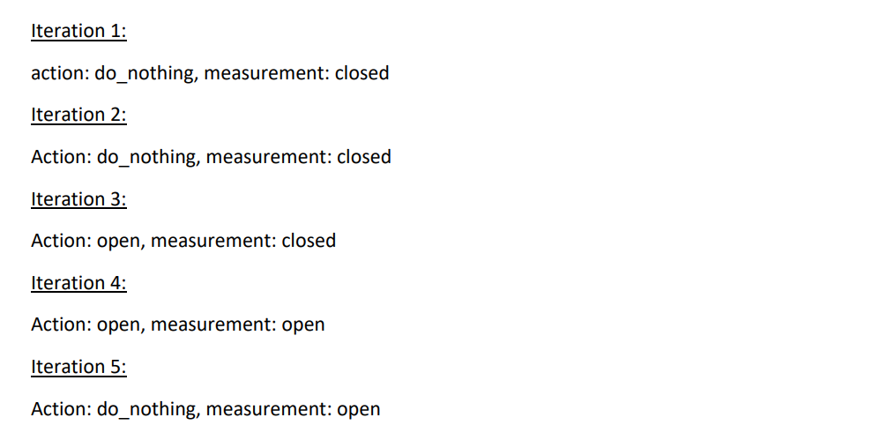
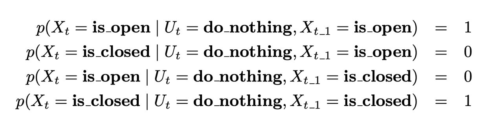
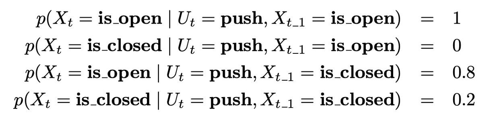
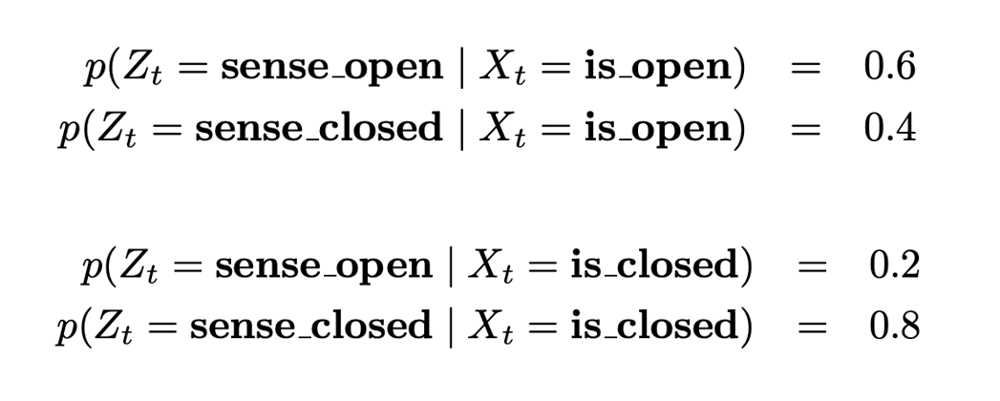
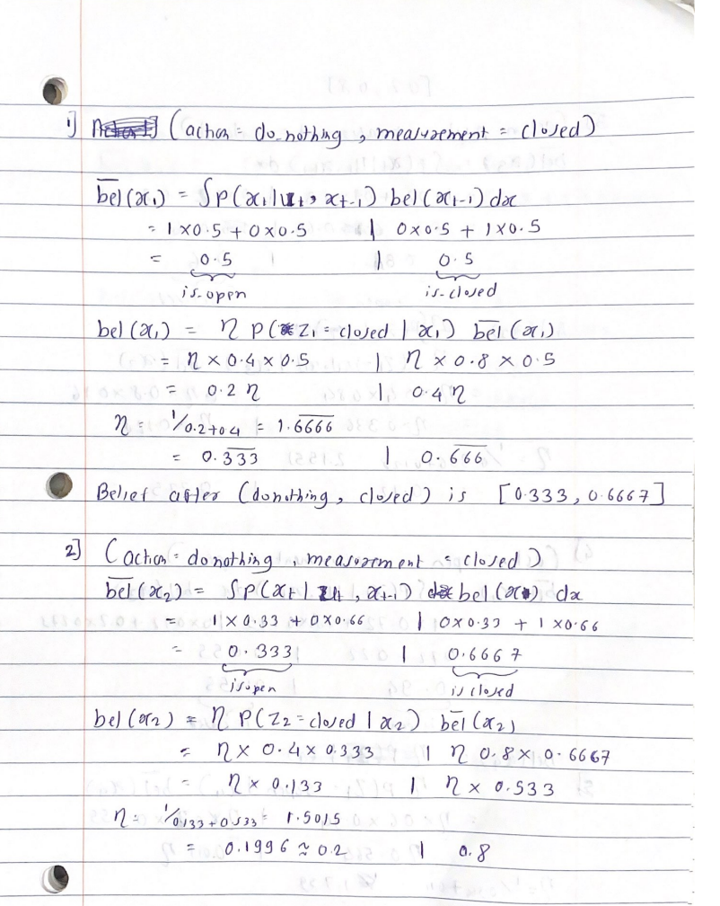
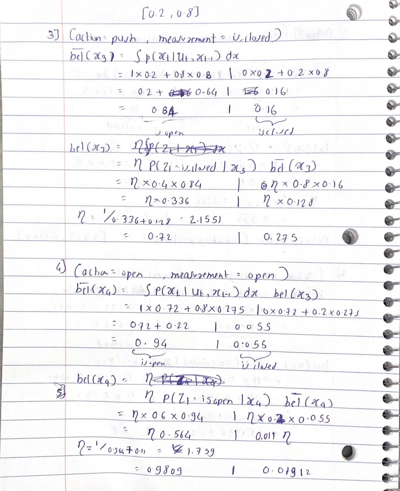
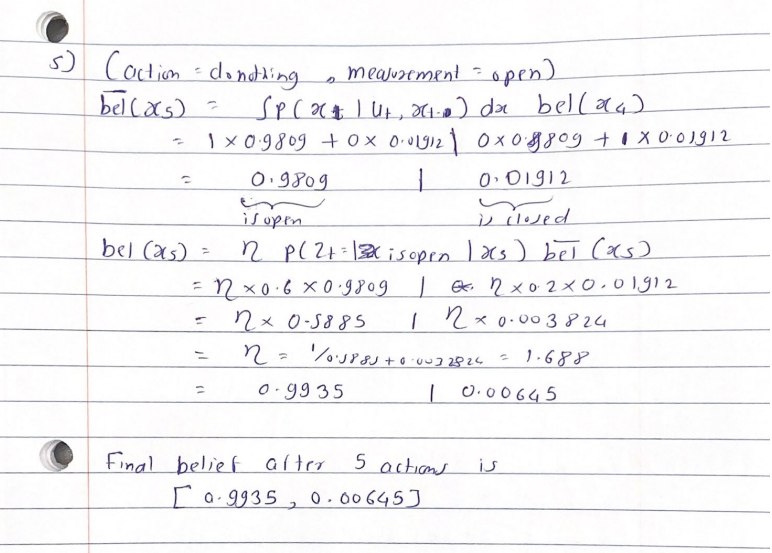
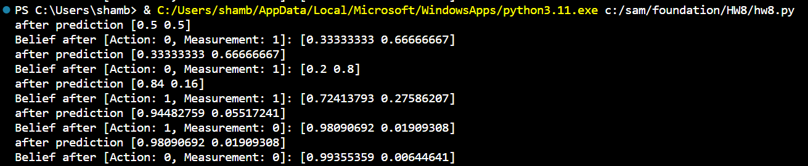

# 5.Python_bayes_filter

## Introduction
A Bayes filter was implemented in Python to calculate a belief regarding the state of a door (open or closed)
based on a series of actions and measurements. The filter was tested with a provided set of 5 action-measurement
pairs, iterating through each one to update the belief at every step.

## Given data:
In this example we have discrete states and discrete actions
States are State of the door Open or Closed and the actions are robot using its arm trying to open the door
and do nothing. The State transition probabilities are as shown in figure 2 and 3.

The robots measurements are noisy. The measurement probabilities are shown in figure 4

## Implementation on paper
The problem is solved on paper first for better understanding of bayes filter algorithm. Th calculations are as
follows:

## Implementation
The Python code implements a Bayesian filter for a door state estimation problem using the provided transition
and measurement models. The bayes filter function takes three parameters: the current belief state, an action
(0 for do nothing, 1 for push), and a measurement (0 for is open, 1 for is closed). The code defines transition
models for the actions (do nothing and push) and a fixed measurement model. The main loop in the main
function iterates through a list of action-measurement pairs, updating the belief state using the Bayesian filter
for each pair. The initial belief assumes equal probability for the door being open or closed. The code prints
the belief state after each update, providing insights into how the belief evolves based on the given actions and
measurements.
The results are shown in figure 8, which are precisely matching with the calculations on paper.

## Conclusion
The Bayes filter implementation was able to successfully incorporate each action and measurement to update
its belief of the door’s state. Despite some conflicting action-measurement pairs, by the end of the 5 action
and measurement pair updates the filter converged on an accurate final belief distribution reflecting the true
underlying state.
